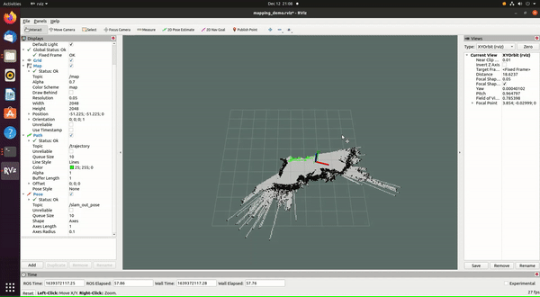
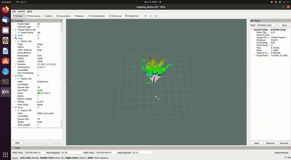

# hps3d_ros

A project that involves the Hypersen HPS3D160 Lidar (no odometry) to collect pointcloud data and convert that into laserscan messages to enable hector slam to function. Also includes Octomapping to visualize the surrounding objects in 3D.

Includes a static tf to transform baselink to laser to orientate the laserscan for hector slam.

## References

- [How to configure Hector slam launch files to SLAM with no odometry](https://github.com/NickL77/RPLidar_Hector_SLAM)
- [Youtube video](https://www.youtube.com/watch?v=Qrtz0a7HaQ4&t=475s) explaining how to set up a RPlidar with Hector Slam

## Dependencies

- Octomap_mapping
- PCL ros
- pointcloud_to_laserscan
- HPS3D sdk
- Hector slam
- Ubuntu 20.04 desktop
- ROS Noetic

```bash
sudo apt install ros-noetic-hector-slam
sudo apt install ros-noetic-octomap-mapping
```

## Execute

Add the tutorial1.launch and mapping_default.launch file into the respective hector package.

```bash
roscd hector_slam_launch
roscd hector_mapping
```

Ensure that you run the lidar node first.

```bash
cd ~/ws
source devel/setup.bash
roslaunch hps_camera sample_node1.launch
```

In a new terminal run

```bash
roslaunch hector_slam_launch tutorial1.launch
```

## Sample

Hector slam only.



Hector slam with Octomap.

