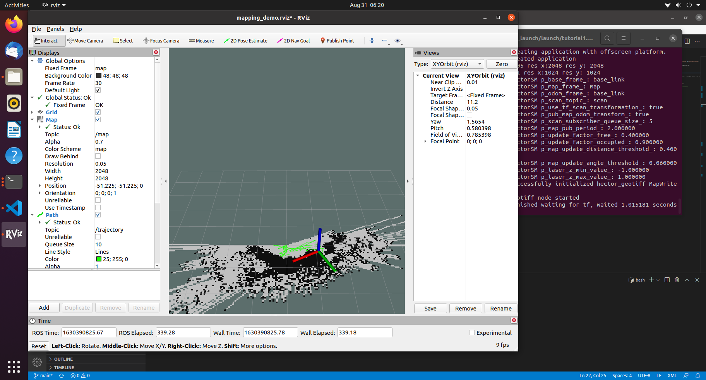

# hps3d_ros

A project that involves the Hypersen HPS3D160 Lidar to collect pointcloud data and convert that into laserscan messages to enable hector slam to function.

## References

- [How to configure Hector slam launch files to SLAM with no odometry](https://github.com/NickL77/RPLidar_Hector_SLAM)
- [Youtube video](https://www.youtube.com/watch?v=Qrtz0a7HaQ4&t=475s) explaining how to set up a RPlidar with Hector Slam

## Dependencies

- Octomap_mapping
- PCL ros
- pointcloud_to_laserscan
- HPS3D sdk
- Hector slam
- Ubuntu 20.04 desktop
- ROS Noetic

## Sample

